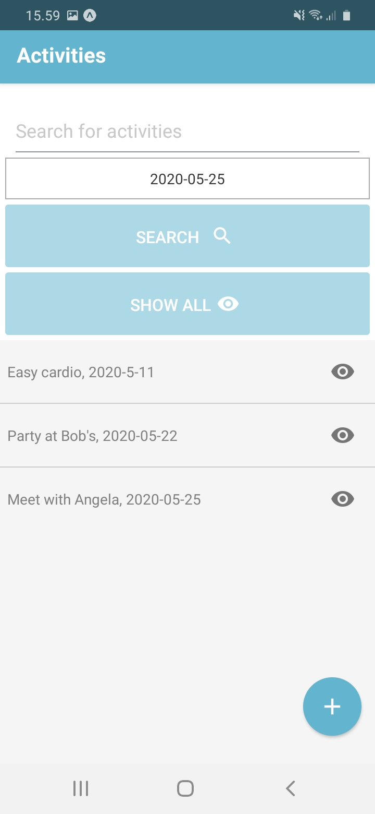
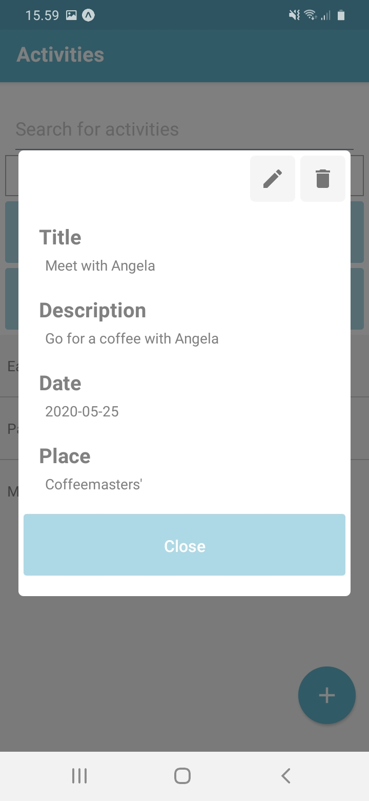

# Event-List-App

## About

This is a small React Native application made for a school project. The user is able to create new events, edit already added events, search events, and delete them. The events are stored in a SQLite database locally to the user's phone.

## To-do

Clean-up
  * **UNDER WORK ->**(Create separate stylesheets)
  * Comment code

Features
  * Implement a smarter way to add location to event (map with coordinates?)
  * Change DatePicker to something else
  * Search with date and by search-word independently

Bugs
  * Update list after adding event
  * Show all events after updating one event

This page
  * Create instructions on how to install/run this project
  * **UNDER WORK ->**(Add pictures)

Created by [Elmo Rohula.](https://github.com/rootElmo)
